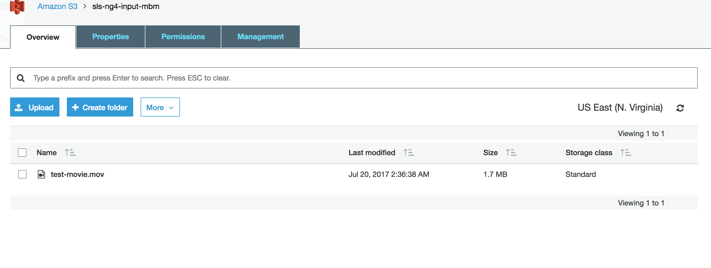
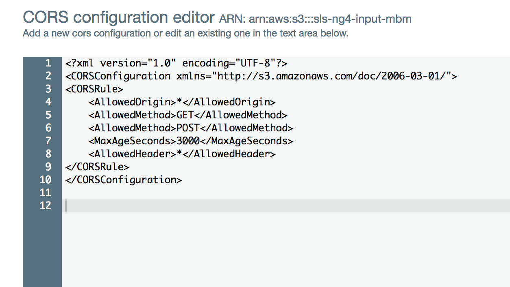
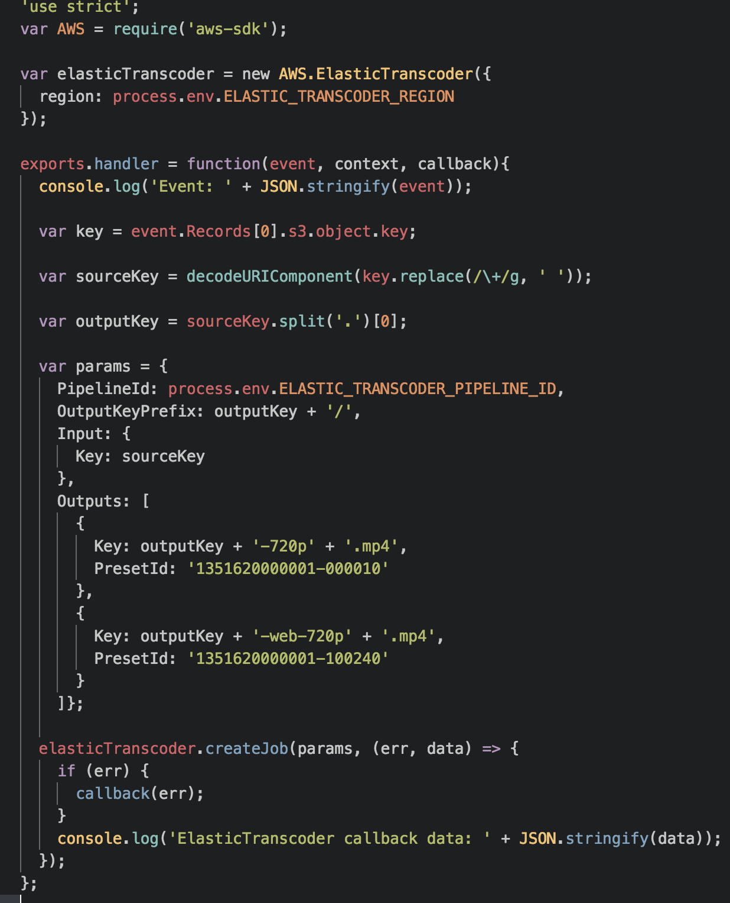
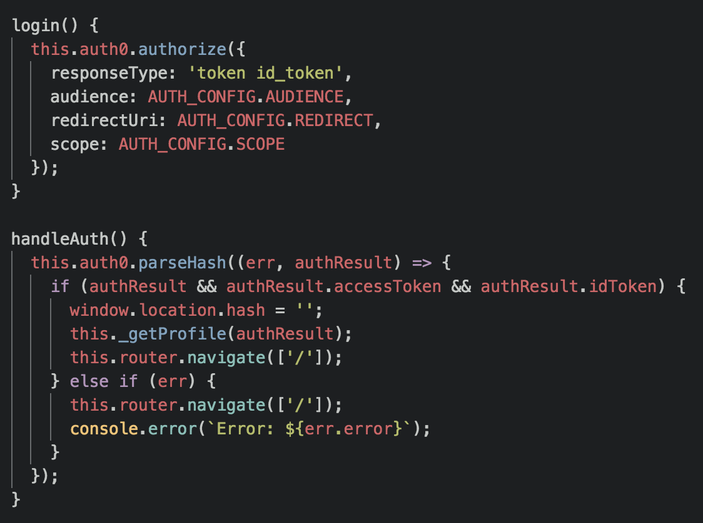
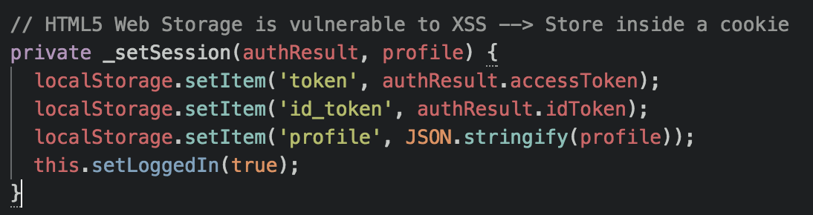
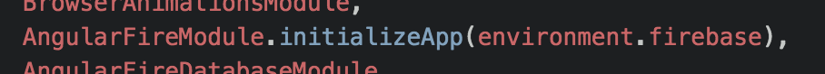
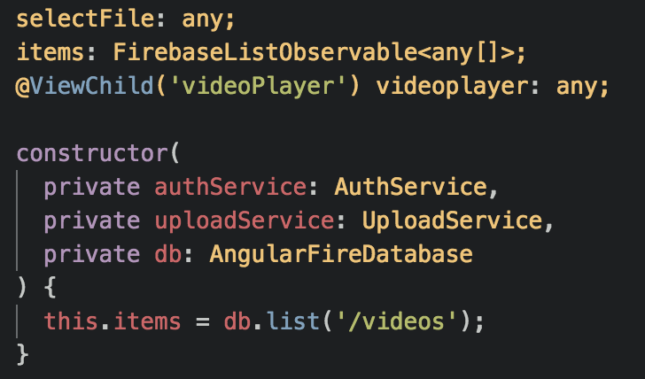

# Serverless Angular Architecture
### Reginald Davis

##### Twitter: @madblkman

---

### What are we going to talk about today?

- What exactly is "Serverless"? |
- The pros and cons of using serverless architecture? |
- Parts of a serverless architecture |
- How much is this thing going to cost me? |
- Is this something worth implementing on my next project? |

---

## What is "Serverless"?

---

"Serverless" refers to an architecture that depends on "Baas" (Backend as a Service) or custom code that lives in an temporary container (Function as a Service || "FaaS").

---

The name "Serverless" is a bit of a misnomer and refers more to the fact that the user running the code the code doesn't have to purchase or rent a server or VM to do so.

---

Serverless architecture isn't a end all, be all solution to your back-end. It can be used in addition to typical server-side code or your back-end can be entirely serverless.

---

## If it's serverless, what happened to the servers?

---

# Nothing!

---

Those servers are still around, but instead of having to worry about maintenance or scaling, it's provided as a service to the application layer.

---

# Pros

---

Cost (Think of the "Economy of Scale")

---

Reduced development Cost

- AuthO |
- Firebase |
- Lambda |

---

Scaling Cost

---

Horizontal scaling is completely automatic, elastic, and managed by the provider.

---

Less components, less work

- No needed to worry about complex packaging and deployment |
- Fully serverless doesn't require a Sys Admin |

---

Experimentation made easy

---

# Cons

---

Vendor lock-in

Note: What other vendor-specific parts are associated with your functions?

---

Multitenancy

Note: Think of "shared hosting"

---

Sacrifice of system control

- System downtime |
- Forced API upgrades |
- Loss of functionality |
- Unexpected limits |
- Cost changes |

---

Debugging and Monitoring/Tooling

Note: IOPipe.com, AWS Step Functions

---

Complex Architecture

- How small should a function be? |
- How many functions are too many functions? |
- Function management |

---

Hacks to maintain function performance (i.e. - "cold starts").

Note: Creating a CloudWatch scheduled to invoke the function to maintain performance

---

Security

Note: How safe is it for a client-side app to talk directly to a DBaaS (Database as a Service)? What about Auth0? What is the best way to store JWTs? (Hint: Place them in a cookie to protect against CSRF(cross-script request forgery) with modern web frameworks)

---

# Parts used in a serverless architecture

---

## S3

---

S3 is a object storage that can be used to host everything from websites, images, videos, and a host of other files.

---

---

---

## Lambda

---

Lambda is AWS' FaaS. It will be used as our backend to handle backend processes.

---

## Elastic Transcoder

---

This is a service offered by AWS that will allow us to transcode files to any format we request.

---

---

## AuthO

---

A microservice used to authenticate and manage users.

---

---

---

## Firebase

---

This is a DBaaS (Database as a Service) offered from Google which will allow a client-side application to communicate directly to a database in the cloud.

---

---

---

## API Gateway

---

An API Gateway is a HTTP Sever where endpoints are defined in configuration and each route is associated with a FaaS function.

---

This is a necessary part of a serverless architecture if you need to make HTTP calls since Lambda/FaaS are not made to talk directly to the outside world.

---

### Resources and References

- [AuthO - What is Serverless](https://auth0.com/blog/what-is-serverless/)
- [What is Serverless Architecture? What are its criticisms and drawbacks?](https://medium.com/@MarutiTech/what-is-serverless-architecture-what-are-its-criticisms-and-drawbacks-928659f9899a)
- [Serverless Architectures](https://martinfowler.com/articles/serverless.html)
- [What is Serverless Computing?](https://www.iron.io/what-is-serverless-computing/)
- [Serverless Framework](https://serverless.com/)
- [WTF is Operations #Serverless](https://charity.wtf/2016/05/31/wtf-is-operations-serverless/)
- []
